 

&nbsp;·&nbsp;

&nbsp;·&nbsp;

&nbsp;·&nbsp;

---

 

### 🧑‍💻 About Me

 

Hey! I'm **Jitu Dey**, a passionate **Web Developer** from Bangladesh. I'm continuously learning and building modern, responsive, and user-friendly web applications.

 

👨‍💻 &nbsp; **What I Do:** Build modern and responsive web applications with clean, user-friendly interfaces.  
🚀 &nbsp; **Currently Learning:** React, Next.js, TypeScript, and modern web development.  
❤️ &nbsp; **What I Like:** Coding, learning new technologies, solving problems, and building real-world projects.  
🎯 &nbsp; **Future Goal:** Become a professional **Full-Stack Developer** and build scalable real-world applications.  

 

---

### 🛠️ Tech Stack

 

  

  

  

---

### 🏆 GitHub Trophies

 

 

---

### 📊 GitHub Statistics

 

&nbsp;&nbsp;

  

 

---

### 📈 Contribution Graph

 

 

---

### 📋 Profile Summary

 

 

 

---

 

*"The expert in anything was once a beginner."* — Helen Hayes

  

Thanks for visiting — drop a ⭐ if you like my work!

